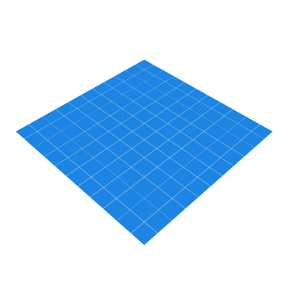
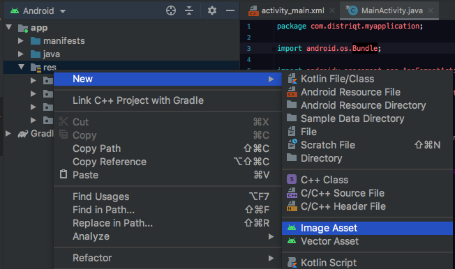
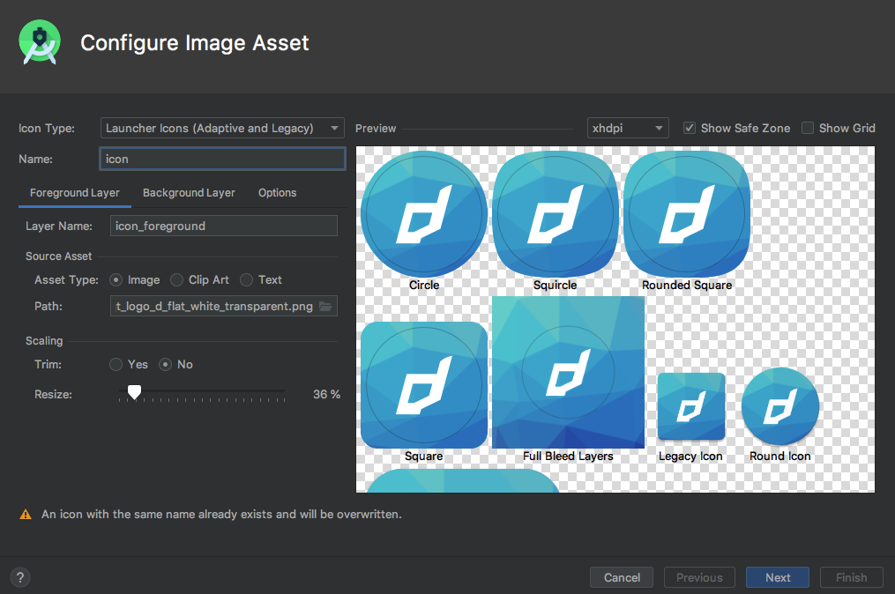
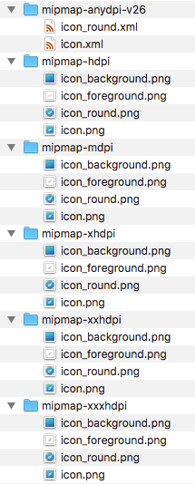

# Android Adaptive Icons


Android 8.0 (API level 26) introduces adaptive launcher icons, which can display a variety of shapes across different device models. For example, an adaptive launcher icon can display a circular shape on one OEM device, and display a squircle on another device. Each device OEM provides a mask, which the system then uses to render all adaptive icons with the same shape. Adaptive launcher icons are also used in shortcuts, the Settings app, sharing dialogs, and the overview screen.


| | |
| --- | --- | 
|  |  |


You can control the look of your adaptive launcher icon by defining 2 layers, consisting of a background and a foreground. You must provide icon layers as drawables without masks or background shadows around the outline of the icon.





More information:
- [Adaptive Icons](https://developer.android.com/guide/practices/ui_guidelines/icon_design_adaptive)
- [Design adaptive icons](https://medium.com/google-design/designing-adaptive-icons-515af294c783)


## Adobe AIR

Currently AIR does not generate adaptive icons automatically. You will most likely see your icon surrounded by a white area as in the icon on the left below. By adding adaptive icons we can make our AIR application a first class citzen with an icon that adapts with the OS. The icon on the right implements the adaptive icons approach contained here.


There are two steps to adding adaptive icons to your application:

- Creating or generating the adaptive icon resources;
- Packaging these resources with your application.

There is no changes to the code of your application required, only the need to generate and package additional resources.


**Note: You should still package icons using the existing method in AIR (in the application descriptor) in order to correctly support older versions of Android that do not support adaptive icons (< v26)!**


Additionally if you want to enable "round" icons you need to add the `android:roundIcon` tag to your `application` node in the manifest additions:


```xml
<manifest android:installLocation="auto">

    <uses-sdk android:targetSdkVersion="28" />

    <!-- PERMISSIONS ETC -->

    <application 
        ...
        android:roundIcon="@mipmap/icon_round" 
        ...
    >

```

>
> You must only use the `android:roundIcon` attribute if you require a different icon asset for circular masks, if for example the branding of your logo relies on a circular shape.
>


## Generating Adaptive Icons

Adaptive icons use a foreground image and a background image or colour to create the icon.

The foreground image can contain transparency but the background image should not. 


The simplest way to create the resources is to open up a new project in Android Studio and launch the image asset tool.

- Launch Android Studio;
- Create a new project with an empty activity and fill in some dummy information for the project;
- Open the Android view in the Project explorer;
- Right click on the `res` folder and select *New > Image Asset*




 
This will launch the tool:

- Select *Launcher Icons (Adaptive and Legacy)* from the icon type;
- Enter **`icon`** in the *Name* field. **It is important that you use this name to correctly integrate with AIR**;
- Set your foreground and background layers as per your requirements;
    - You can import an image for the foreground and background;
    - Scale images appropriately;
- Click next and finish the process.




You should now have a list of resources in the *`res/mipmap-*`* folders:



These folders are the resources that you will need to package in the next section.

The following link contains an example of the resources we have used in some of our example applications.

- [Example Resources](adaptive-icons-example-resources.zip)

The important file to note is the `mipmap-anydpi-v26/icon.xml`. This is the file that defines the adaptive icon layers as you see below:

```xml
<?xml version="1.0" encoding="utf-8"?>
<adaptive-icon xmlns:android="http://schemas.android.com/apk/res/android">
    <background android:drawable="@mipmap/icon_background"/>
    <foreground android:drawable="@mipmap/icon_foreground"/>
</adaptive-icon>
```

The other files are just the different sized image resources for the different device screen densities.


## Packaging 

### Resources in ANEs 

It is possible to to package your adaptive icon in a [Custom Resources ANE](https://github.com/distriqt/ANE-CustomResources). 

This has the advantage of not requiring modification of the AIR SDK, instead simply packaging an ANE with your application containing the adaptive icon. 

All that is required here is adding the resources created above to your custom resources extension and packaging that ANE with your application. Follow the directions in the repository link above to help create your custom resources extension, or contact us and we can create one for you.


### Modifying the AIR SDK

The simplest method to give your AIR application an adaptive icon is to add your adaptive icon resources to the AIR SDK.

This method requires no creation of an ANE and similarly requires no changes to your code, however you will have to modify your version of the AIR SDK, for each application you package.

To get started open up the AIR SDK Android resources directory located at `AIRSDK/lib/android/lib/resources/app_entry/res/`. This directory contains all of the resources that AIR will package with your application.

Copy all the resources you generated earlier in the `mipmap` folders into the AIR SDK directory, being careful to merge any existing folders. Now repackage your application with the modified SDK and you should now see the adaptive icon.
