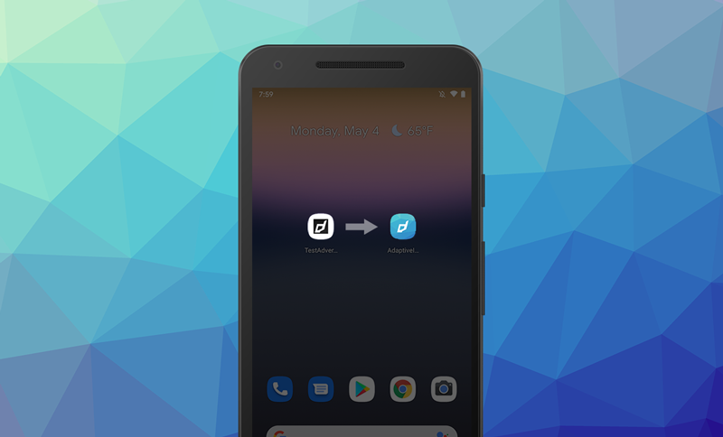

# Android Adaptive Icons

Android 8.0 (API level 26) introduces adaptive launcher icons, which can display a variety of shapes across different device models. For example, an adaptive launcher icon can display a circular shape on one OEM device, and display a squircle on another device. Each device OEM provides a mask, which the system then uses to render all adaptive icons with the same shape. Adaptive launcher icons are also used in shortcuts, the Settings app, sharing dialogs, and the overview screen.

| | |
| --- | --- | 
|  |  |

You can control the look of your adaptive launcher icon by defining 2 layers, consisting of a background and a foreground. You must provide icon layers as drawables without masks or background shadows around the outline of the icon.

More information:
- https://developer.android.com/guide/practices/ui_guidelines/icon_design_adaptive
- [Design adaptive icons](https://medium.com/google-design/designing-adaptive-icons-515af294c783)

## Adobe AIR

Currently AIR does not generate adaptive icons automatically. 

There are two steps to adding adaptive icons to your application:

- Creating or generating the adaptive icon resources;
- Packaging these resources with your application.

## Generating Adaptive Icons

Adaptive icons use a foreground image and a background image or colour to create the icon.

## Packaging 

### Modifying the AIR SDK

The simplest method to give your AIR application an adaptive icon is to add your adaptive icon resources to the AIR SDK.

This method generally requires no modification to your application code, however you will have to modify your version of the AIR SDK.

To get started open up the AIR SDK Android resources directory located at `AIRSDK/lib/android/lib/resources/app_entry/res/`. This directory contains all of the resources that AIR will package with your application.

### Resources in ANEs 

It is possible to to package your adaptive icon in a [Custom Resources ANE](https://github.com/distriqt/ANE-CustomResources). 

This has the advantage of not requiring modification of the AIR SDK, instead simply packaging an ANE with your application containing the adaptive icon. 

