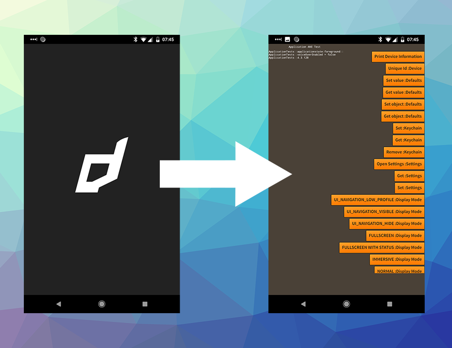
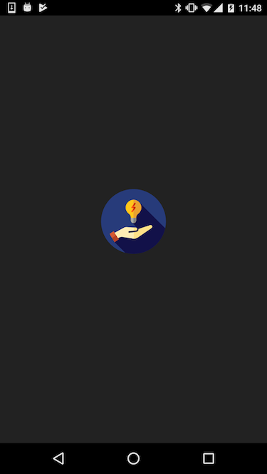

# Android Splash Screen

Android doesn't have a built in method of displaying an image at launch like iOS does however there are some techniques we can use to achieve a similar goal.




## Modifying the AIR SDK

The simplest method to give your AIR application a splash screen on Android is to change the theme of the main AIR activity to contain an image and a background colour.

This method generally requires no modification to your application code, however you will have to modify your version of the AIR SDK.

To get started open up the AIR SDK `styles.xml` file located at `AIRSDK/lib/android/lib/resources/app_entry/res/values/styles.xml`

This file should contain the following:

```xml
<resources>
    <style name="Theme.NoShadow" parent="android:style/Theme.NoTitleBar">
        <item name="android:windowContentOverlay">@null</item>
    </style>
</resources>
```

To start, remove `android:windowContentOverlay` and add a `android:windowBackground` as below:

```xml
<resources>
    <style name="Theme.NoShadow" parent="android:style/Theme.NoTitleBar">
        <item name="android:windowBackground">@drawable/splash_background</item>
    </style>
</resources>
```


This will set a `splash_background` resource as the background. Lets create this resource by adding a `splash_background.xml` file at the following location: `AIRSDK/lib/android/lib/resources/app_entry/res/drawable/splash_background.xml`

This is where we will create the background for your application which will appear as the splasg screen.


### Reverting

To revert your changes you simply revert the `styles.xml` to the original contents above.

i.e.

```xml
<resources>
    <style name="Theme.NoShadow" parent="android:style/Theme.NoTitleBar">
        <item name="android:windowContentOverlay">@null</item>
    </style>
</resources>
```


### Centered Application Icon

A simple splash screen is to use your application icon and center it in the view with a background colour. 

Add the following content to the `splash_background.xml` file:

```xml
<?xml version="1.0" encoding="utf-8"?>
<layer-list xmlns:android="http://schemas.android.com/apk/res/android">
    <item android:drawable="@color/splash_background_color" />
    <item>
        <bitmap
            android:gravity="center"
            android:src="@mipmap/icon" />
    </item>
</layer-list>
```

We will define the background colour in the `colors.xml` located at `AIRSDK/lib/android/lib/resources/app_entry/res/values/colors.xml`

```xml
<?xml version="1.0" encoding="utf-8"?>
<resources>
    <color name="splash_background_color">#ff0000</color>
</resources>
```

Change this background colour to suit your application.


Once you've made these changes to the AIR SDK any Android application that is built with this AIR SDK will display your splash screen.


### Image

Alternatively if you want to use a custom image as the splash screen you can add an image file to the resources to use as the background. 

For example lets add a `splash_image.png` to the `drawable` directory (alongside `splash_background.xml`), you then need to modify `splash_background.xml` to use this image as below:

```xml
<?xml version="1.0" encoding="utf-8"?>
<layer-list xmlns:android="http://schemas.android.com/apk/res/android">
    <item>
        <bitmap 
            android:gravity="center"
            android:src="@drawable/splash_image" />
    </item>
</layer-list>
```

When using this method we advise that you add all the different dpi versions of your image to correctly support different screen sizes: Read more here: [https://developer.android.com/guide/practices/screens_support.html](https://developer.android.com/guide/practices/screens_support.html)


### Resources in ANEs 

It is possible to to package your splash screen in a [Custom Resources ANE](https://github.com/distriqt/ANE-CustomResources). This has the advantage of being able to modify the SDK once and then use a custom ANE to specify the splash screen for each of your applications, rather than have to modify the AIR SDK before each build.

This is done by setting up a default splash screen drawable resource in your AIR SDK and then *overriding* this resource with resources packaged in the ANE. Normally this would result in a resource conflict however we can use a small trick here. By providing a non resolution specific drawable resource in the AIR SDK and then overriding it with resolution specific versions.

#### AIR SDK Modifications

Lets start by again adjusting the AIR SDK by specifying a `splash_background` resource in the `styles.xml` resource located at `AIRSDK/lib/android/lib/resources/app_entry/res/values/styles.xml`:

```xml
<resources>
    <style name="Theme.NoShadow" parent="android:style/Theme.NoTitleBar">
        <item name="android:windowBackground">@drawable/splash_background</item>
    </style>
</resources>
```

Then lets create a fallback resource a simple 1x1 pixel black png called `splash_background.png` and place it in the AIR SDK at `AIRSDK/lib/android/lib/resources/app_entry/res/drawable/splash_background.png`. This is the resource that will be used if we don't package an ANE containing the override resource.

You should find your AIR SDK packages normally and start with the expected black screen before loading your SWF.

#### ANE Resource

Next lets create the actual resource we will use for the splash in the ANE. You can use the same methods as above however instead of placing the drawable resource in `drawable` place a version in each of the resolution specific directories:

- `drawable-hdpi`
- `drawable-mdpi`
- `drawable-xhdpi`
- `drawable-xxhdpi`
- `drawable-xxxhdpi`

>
> This is the important step! If you included the resource in the `drawable` directory your resource would conflict with the resource created in the AIR SDK and it will fail to package. However adding it to the resolution specific directories means it can override the AIR SDK resource without causing any issues.
>
> This small trick was pointed out by **mfrasier** on the Starling forum.
>


You can use a simple stretched image `drawable-hdpi/splash_background.png`, a 9-patch png `drawable-hdpi/splash_background.9.png`, or an xml resource `drawable-hdpi/splash_background.xml`. 

We most commonly use the xml method, including another image that is centered in the layout as a drawable:

```xml
<?xml version="1.0" encoding="utf-8"?>
<layer-list xmlns:android="http://schemas.android.com/apk/res/android">
    <item>
        <bitmap
            android:gravity="center"
            android:src="@drawable/splash_logo" />
    </item>
</layer-list>
```


### Vector Drawables

A VectorDrawable is a vector graphic defined in an XML file as a set of points, lines, and curves along with its associated color information. You can use vector drawables in your splash screen. It was introduced in Android 5.0 (API 21).

We have run into some issues with getting them to scale when centered on Android API < 23, but the process we used is outlined below.

Firstly create your vector drawable resource in the `drawable` directory (`AIRSDK/lib/android/lib/resources/app_entry/res/drawable`), say `splash_icon.xml`, for example this renders the battery charging image from the [Android Guide](https://developer.android.com/guide/topics/graphics/vector-drawable-resources.html):

```xml
<vector xmlns:android="http://schemas.android.com/apk/res/android"
    android:height="24dp"
    android:width="24dp"
    android:viewportWidth="24.0"
    android:viewportHeight="24.0">
   <group
         android:name="rotationGroup"
         android:pivotX="10.0"
         android:pivotY="10.0"
         android:rotation="15.0" >
      <path
        android:name="vect"
        android:fillColor="#FF000000"
        android:pathData="M15.67,4H14V2h-4v2H8.33C7.6,4 7,4.6 7,5.33V9h4.93L13,7v2h4V5.33C17,4.6 16.4,4 15.67,4z"
        android:fillAlpha=".3"/>
      <path
        android:name="draw"
        android:fillColor="#FF000000"
        android:pathData="M13,12.5h2L11,20v-5.5H9L11.93,9H7v11.67C7,21.4 7.6,22 8.33,22h7.33c0.74,0 1.34,-0.6 1.34,-1.33V9h-4v3.5z"/>
   </group>
</vector>
```

This renders: 


Then to use this in your splash screen, change your `splash_background.xml` file to the below:

```xml
<?xml version="1.0" encoding="utf-8"?>
<layer-list xmlns:android="http://schemas.android.com/apk/res/android">
    <item android:drawable="@color/splash_background_color" />
    <item 
        android:gravity="center" 
        android:drawable="@drawable/splash_icon">
    </item>
</layer-list>
```


Using this method you can create fairly complex scalable images without adding much to your application.




This was generated from the following vector drawable xml:


```xml
<vector xmlns:android="http://schemas.android.com/apk/res/android"
    android:width="100dp"
    android:height="100dp"
    android:viewportHeight="512.0"
    android:viewportWidth="512.0">
    <path
        android:fillColor="#273B7A"
        android:pathData="M256,256m-256,0a256,256 0,1 1,512 0a256,256 0,1 1,-512 0" />
    <path
        android:fillColor="#121149"
        android:pathData="M506.4,309.5L300.1,103.3l-62.2,113.4l2.3,44.8l82.5,82.5l-3.4,3.4l-35.8,-35.8l-45.6,2.9h-64.7l-66.7,105.5l83.6,83.6C211.2,509 233.2,512 256,512C379,512 481.8,425.2 506.4,309.5z" />
    <path
        android:fillColor="#FFEDB5"
        android:pathData="M401.6,290.3c-3.3,-4.6 -9.3,-6.4 -14.6,-4.4c-0.1,0 -0.2,0.1 -0.2,0.1l-89.6,29.8c0,0.7 0,1.4 -0,2.2c-0.7,11.4 -9.6,20.6 -21,21.8l-54,5.6c-3.4,0.4 -6.5,-2.1 -6.8,-5.5c-0.4,-3.4 2.1,-6.6 5.5,-6.8l54,-5.6c5.3,-0.6 9.5,-4.9 9.8,-10.2c0.2,-2.9 -0.8,-5.8 -2.7,-8c-1.9,-2.2 -4.6,-3.5 -7.6,-3.7l-71.7,-4.7c-8.1,-0.5 -16,1.3 -23.1,5.1L85,358l25.6,51.6l23.8,-20.7c10.1,-8.8 23.5,-12.6 36.7,-10.4l79.4,13.2c14.6,1.9 29.1,-1.7 41.1,-10.2l108.1,-74.5C404.5,302.8 405.4,295.5 401.6,290.3z" />
    <path
        android:fillColor="#FEE187"
        android:pathData="M274.9,327.4c5.3,-0.6 9.5,-4.9 9.8,-10.2c0.2,-2.9 -0.8,-5.8 -2.7,-8c-1.9,-2.2 -4.6,-3.5 -7.6,-3.7l-15.9,-1v24.7L274.9,327.4z" />
    <path
        android:fillColor="#FEE187"
        android:pathData="M401.6,290.3c-3.3,-4.6 -9.3,-6.4 -14.6,-4.4c-0.1,0 -0.2,0.1 -0.2,0.1l-89.6,29.8c0,0.7 0,1.4 -0,2.2c-0.7,11.4 -9.6,20.6 -21,21.8l-17.7,1.8v50.6c11.8,-0.1 23.3,-3.8 33.1,-10.7l108.1,-74.5C404.5,302.8 405.4,295.5 401.6,290.3z" />
    <path
        android:fillColor="#FFC61B"
        android:pathData="M317.4,146c0,-34.7 -28.9,-62.8 -63.9,-61.4c-31.4,1.2 -57.1,26.5 -58.9,57.9c-1.2,21.6 8.7,40.9 24.6,52.7c10.1,7.6 16.3,19.2 16.3,31.9v21.3c0,11.3 9.2,20.5 20.5,20.5l0,0c11.3,0 20.5,-9.2 20.5,-20.5V227.4c0,-12.8 6.2,-24.6 16.5,-32.3C307.8,183.9 317.4,166 317.4,146z" />
    <path
        android:fillColor="#EAA22F"
        android:pathData="M255.4,84.6v184.2c0.2,0 0.4,0 0.6,0c11.3,0 20.5,-9.2 20.5,-20.5V227.4c0,-12.8 6.2,-24.6 16.5,-32.3c14.9,-11.2 24.5,-29 24.5,-49.1C317.4,111.9 289.6,84.3 255.4,84.6z" />
    <path
        android:fillColor="#A6A8AA"
        android:pathData="M235.5,227.9v20.5c0,11.3 9.2,20.5 20.5,20.5l0,0c11.3,0 20.5,-9.2 20.5,-20.5v-20.5L235.5,227.9z" />
    <path
        android:fillColor="#808183"
        android:pathData="M255.4,227.9v40.9c0.2,0 0.4,0 0.6,0c11.3,0 20.5,-9.2 20.5,-20.5v-20.5L255.4,227.9z" />
    <path
        android:fillColor="#FF5419"
        android:pathData="M244.2,183.8c-1.1,0 -2.3,-0.3 -3.3,-1.1c-2.5,-1.8 -3,-5.3 -1.2,-7.8l17.1,-23.4H244.2c-2.1,0 -4,-1.2 -5,-3.1c-1,-1.9 -0.8,-4.1 0.5,-5.8l23.6,-32.3c1.8,-2.5 5.3,-3 7.8,-1.2c2.5,1.8 3,5.3 1.2,7.8L255.2,140.4h12.6c2.1,0 4,1.2 5,3.1c1,1.9 0.8,4.1 -0.5,5.8l-23.6,32.3C247.6,183 245.9,183.8 244.2,183.8z" />
    <path
        android:fillColor="#C92F00"
        android:pathData="M272.3,117c1.8,-2.5 1.3,-6 -1.2,-7.8c-2.5,-1.8 -6,-1.3 -7.8,1.2l-7.9,10.8v18.9L272.3,117z" />
    <path
        android:fillColor="#C92F00"
        android:pathData="M267.8,140.4h-12.4v11.2h1.4l-1.4,1.9v18.9l16.9,-23.1c1.2,-1.7 1.4,-3.9 0.5,-5.8C271.8,141.6 269.9,140.4 267.8,140.4z" />
    <path
        android:fillColor="#D35933"
        android:pathData="M66.1,355.1l32.5,-22.2l40.5,64.7l-32.5,22.2z" />
    <path
        android:fillColor="#B54324"
        android:pathData="M139.1,397.6l-20.5,-32.8l-32.4,22.5l20.4,32.6z" />
</vector>
```


