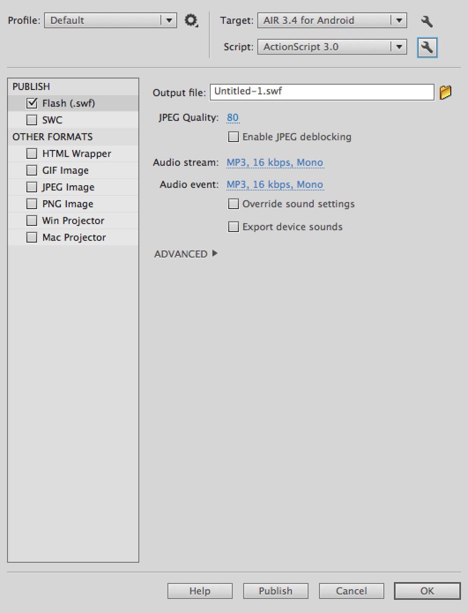
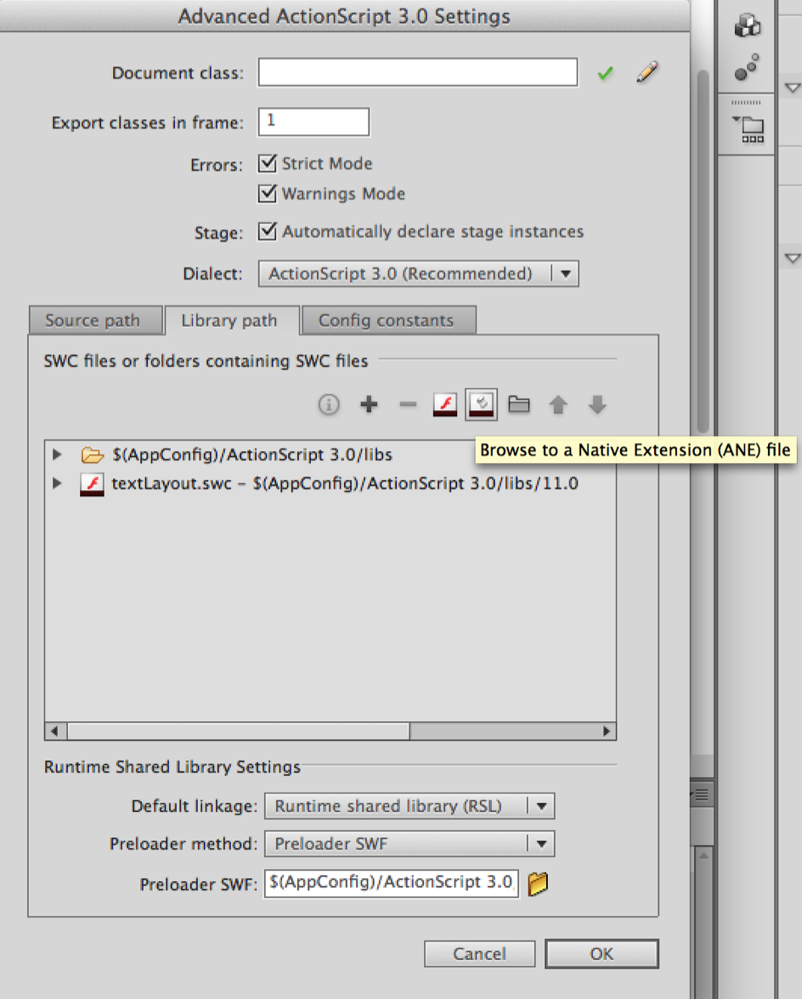

# Getting Started - Animate

This tutorial will guide you the process of adding an ANE to your AIR application project in Adobe Animate.

An AIR Native Extension (ANE) is a single file with the extension `ane`. This file contains all of the native and actionscript libraries that are implemented by this extension. You don’t need access to a separate SWC file or to the source code to be able to use the ANE.


## Adding the Extension

In Animate and Flash CC / CS6 Adobe have added the ability to simply add an ANE to your AIR project. 

You will need to open the Actionscript settings for your project. There are several ways to access this panel either directly through the properties or through the menu as we show below.


In your AIR project FLA file, open your applications publish settings, by going to File > Publish Settings.




Select the wrench icon next to the Script dropdown. This will bring up the ActionScript Settings dialog.




Select the Library path tab and click Browse to a Native Extension (ANE) file, as shown above, and select the ANE file. You should now be able to use the extensions functionality in your project and CS6 will include the ANE code when you publish your application.


This process should add the extension id to your application descriptor however we find it's always good practice to double check with Animate.


## Adding the Extension ID

The extension id is a string that is used to identify the ANE and correctly package and create the extension. The extension id should be provided by the developer of the ANE.

To add the extension id, open up your application descriptor and add the extension id to the `extensions` node as below:

```xml
<?xml version="1.0" encoding="utf-8" ?>
<application xmlns="http://ns.adobe.com/air/application/26.0">

    <!-- OTHER DESCRIPTOR INFORMATION -->

    <extensions>
        <extensionID>com.distriqt.Battery</extensionID>
    </extensions>

</application>
```