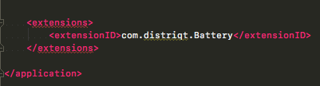

# Getting Started - Animate

This tutorial will guide you the process of adding an ANE to your AIR application project in Adobe Animate.

An AIR Native Extension (ANE) is a single file with the extension `ane`. This file contains all of the native and actionscript libraries that are implemented by this extension. You don’t need access to a separate SWC file or to the source code to be able to use the ANE.


## Adding the Extension

TODO

## Adding the Extension ID

IntelliJ requires that you manually add the extension id to your application descriptor.



The extension id is a string that is used to identify the ANE and correctly package and create the extension. The extension id should be provided by the developer of the ANE.

To add the extension id, open up your application descriptor and add the extension id to the `extensions` node as below:

```xml
<?xml version="1.0" encoding="utf-8" ?>
<application xmlns="http://ns.adobe.com/air/application/26.0">

    <!-- OTHER DESCRIPTOR INFORMATION -->

    <extensions>
        <extensionID>com.distriqt.Battery</extensionID>
    </extensions>

</application>
```