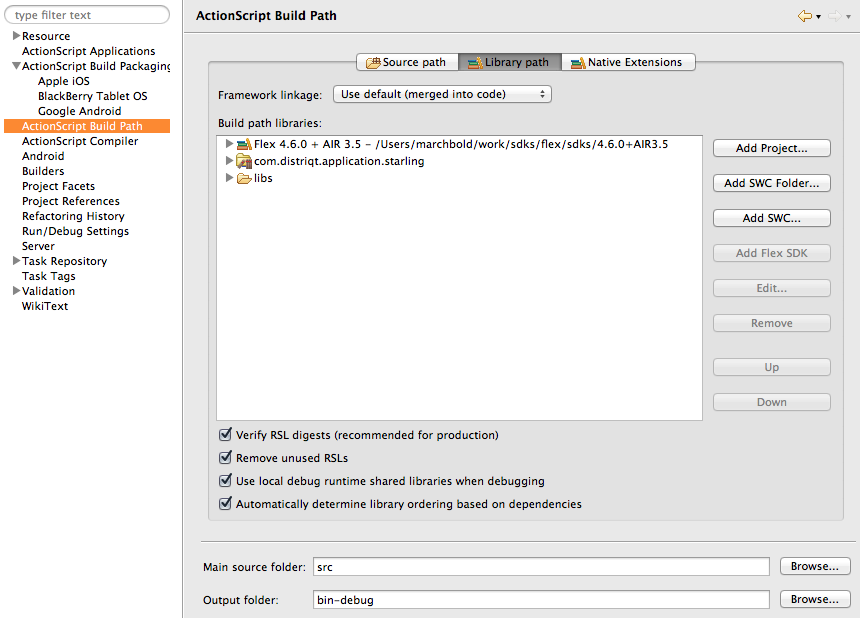
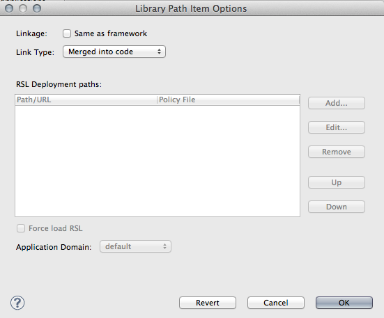

# Getting Started 

## Flash Builder 4.6/4.7

An AIR Native Extension (ANE) is a single file with the extension `ane`. This file contains all of the native and actionscript libraries that are implemented by this extension. You don’t need access to a separate SWC file or to the source code to be able to use the ANE.

Here we will add the extension to your build process so that your application can use the functionality provided by the extension.


The older version of Flash Builder is a lot more complex to get running and unless you are forced to I highly recommend updating to 4.6/4.7. It involves a few scripts and tricks to get it running which we will show on OSX here, but you should be easily able to adapt it to other operating systems.

There are many methods but this is what we have found to be the simplest.

Firstly rename the ANE file to have the extension SWC.

```
com.distriqt.Camera.ane    >     com.distriqt.Camera.swc
```

>
> Note: The part about changing the ANE file’s file extension from .ane to .swc is not strictly necessary. When you browse to find the file, in the “Choose a SWC file” dialog box, you can change the setting of the Files Of Type drop-down field. It is set by default to *.swc. Change it to *.*. This will have the same effect.
>


Then we include the SWC like we do any normal SWC, open:

```
Project / Project Properties / Flex/Actionscript Build Path 
```

In the Library Path tab, click `Add SWC...`




Browse to the SWC file and select Open. The ANE file should now appear in the screen above. You need to now expand the SWC entry and double click the Link Type to open the Library Path Options dialog, as below:




Change the Link Type to be External instead of the default Merged into code.

You should now be able to compile your project, using `Project > Build Project`.

>
> Note: You won’t be able to run this application through the debugger as it won’t correctly package the extension through Flash builder.
>


## Application Descriptor

All AIR applications have an application descriptor file. When an application uses a native extension, the application descriptor file includes an <extensions> element. This node is generally located as the last node in the application descriptor. For example the following shows two extensions added to an application:

```xml
<extensions>
    <extensionID>com.distriqt.Core</extensionID>
    <extensionID>com.distriqt.Camera</extensionID>
</extensions>		
```

You will need to manually add the extension ID to the application descriptor at this stage. 

To enable the extension in your application you need to add some additional information to your application descriptor. Basically this informs the compiler of what extensions are required in your application. Most of the IDEs will add this automatically but it is important to understand what is changing when you add an extension into your application.

More details on the extensions ID can be found [here](http://help.adobe.com/en_US/air/build/WS597e5dadb9cc1e0253f7d2fc1311b491071-8000.html#WS08cc5e527b0868243ea2ffcd1314dff873a-7ffe).

An extension may also require additional permissions or definitions in the application descriptor. For example, requesting permission to access the vibration function with a vibrate extension. You should carefully consult the extensions documentation and add any required additions to the application descriptor. Incorrectly updating the descriptor may mean the extension cannot correctly operate.


### Packaging


Now you’ll need to open up a command line in the directory of your built application. The directory should contain:

- application swf: `myApp.swf`
- application descriptor: `myApp-app.xml`
- any required files such as icons, `Default.png`
- the ANE(s) (in a subdirectory we’ll assume `extensionsDir` in the following)

The details on this command is dependent on the application you are developing and the platform you are targeting. You should review the documentation at the following url to determine the details of what the command should contain for your environment. 

http://help.adobe.com/en_US/air/build/WS597e5dadb9cc1e0253f7d2fc1311b491071-8000.html

For example the following command will create an APK for Android:

```
adt -package
	-target apk
	-storetype pkcs12 -keystore YOUR_SIGNING_KEY.p12
	myApp.apk
	myApp-app.xml
	myApp.swf icons
	-extdir extensionsDir
```


