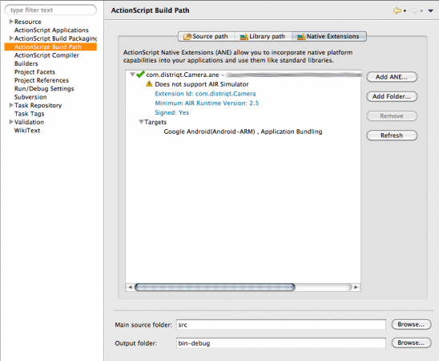
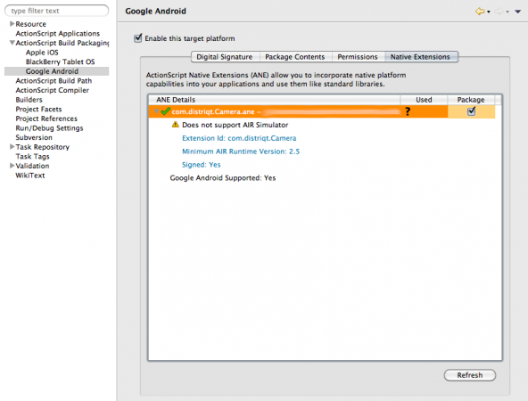

>
> This content is deprecated. See the latest version of this tutorial [here](https://docs.airnativeextensions.com/docs/tutorials/getting-started-flashbuilder4.7)
> 

# Getting Started - Flash Builder 4.6/4.7

## Add the Extension

An AIR Native Extension (ANE) is a single file with the extension `ane`. This file contains all of the native and actionscript libraries that are implemented by this extension. You don’t need access to a separate SWC file or to the source code to be able to use the ANE.

Here we will add the extension to your build process so that your application can use the functionality provided by the extension.

In your mobile project you want to add it into, open up the project properties by right clicking on your project and selecting Properties. Find the "Actionscript Build Path" (or "Flex Build Path" if it's a Flex project).

You will see a tab up the top labeled `Native Extensions` in which you can `Add ANE...`.

Click on this and select the ANE extension file. Once it's added in, you can expand out the details of the extension to see the target platforms supported by the extension. Below I'm showing the details on our Android Camera Extension.

The extension is now included in your project, however before you leave the project settings, go to the "Build Packaging" for the platforms you are deploying and check the extension is going to be packaged (and available) with them.

You should now be able to return to your code and use the functionality and classes supplied in the extension, hopefully you've been supplied with documentation or example usage of the extension.

