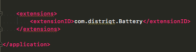

>
> This content is deprecated. See the latest version of this tutorial [here](https://docs.airnativeextensions.com/docs/tutorials/getting-started-flashdevelop)
> 

# Getting Started - Flash Develop

This tutorial will guide you the process of adding an ANE to your AIR application project in FlashDevelop.

An AIR Native Extension (ANE) is a single file with the extension `ane`. This file contains all of the native and actionscript libraries that are implemented by this extension. You don’t need access to a separate SWC file or to the source code to be able to use the ANE.


## Adding the Extension

For the purposes of this example we are going to create directories named `extensions` and `extensions-extracted`. You can name the directories as you require, and they can be the same directory if you wish, however we will keep them separated here to demonstrate the usage of each.

- Copy the ANE to the `extensions` directory;
- In FlashDevelop, right click on the ANE file and select **Add To Library**
- Unzip the ANE to a folder named `extension_id.ane`, in the `extensions-extracted` directory
  - the extension id is not neccessarily the same as the name of the ANE file however with nearly all distriqt's ANEs it will be, see below to determine howto get the extension id from an ANE;

> 
> An ANE is simply a zip container so you can directly unzip it, or if you need to, rename it to have the `.zip` extension and open it in your zip software.
> 

For example with the Battery ANE, you should have the following:

```
extensions/com.distriqt.Battery.ane

extensions-extracted/com.distriqt.Battery.ane/mimetype
extensions-extracted/com.distriqt.Battery.ane/catalog.xml
extensions-extracted/com.distriqt.Battery.ane/library.swf
extensions-extracted/com.distriqt.Battery.ane/META-INF/ANE/extension.xml
extensions-extracted/com.distriqt.Battery.ane/META-INF/ANE/Android-ARM/library.swf
extensions-extracted/com.distriqt.Battery.ane/META-INF/ANE/Android-ARM/distriqt.extension.battery.android.jar
...
```

Unzipping the extension to the extracted directory is used by Flash Develop for debug launches. **You should ensure every time you update an ANE that you update the extracted folder as well.**


## Adding the Extension ID

FlashDevelop requires that you manually add the extension id to your application descriptor.



The extension id is a string that is used to identify the ANE and correctly package and create the extension. The extension id should be provided by the developer of the ANE.

To add the extension id, open up your application descriptor and add the extension id to the `extensions` node as below:

```xml
<?xml version="1.0" encoding="utf-8" ?>
<application xmlns="http://ns.adobe.com/air/application/26.0">

    <!-- OTHER DESCRIPTOR INFORMATION -->

    <extensions>
        <extensionID>com.distriqt.Battery</extensionID>
    </extensions>

</application>
```


### Determining the Extension ID

The native extension ID is not necessarily the name of the ANE file. If you are unsure of the extension id it can be determined from the extracted contents of the ANE.

- Unzip the ANE;
- Open `META-INF/ANE/extension.xml`;
- Find the `<id>` tag, this will contain the extension id;

For example for the Battery ANE:

```xml
<extension xmlns="http://ns.adobe.com/air/extension/4.0">
	<id>com.distriqt.Battery</id>
	<versionNumber>1.0.0</versionNumber>
	<platforms>
    ...
```


> 
> With the distriqt extensions the extension id is the name of the ANE file, eg for the Battery ANE the file is `com.distriqt.Battery.ane` and the extension id is `com.distriqt.Battery`.
>
> Extensions that have multiple versions, eg PushNotifications, where there are multiple files:
> - `com.distriqt.PushNotifications.ane` 
> - `com.distriqt.PushNotifications.AllServices.ane` 
> - `com.distriqt.PushNotifications.Azure.ane` 
> - `com.distriqt.PushNotifications.FCM.ane` 
>
> the extension id is the first part of the filename without the variant: i.e. `com.distriqt.PushNotifications`
>
> If you have any concerns drop a question in github and we will clear up any confusion.
>


## Modify Build Scripts

FlashDevelop uses a series of scripts to package and run your application. We have to modify these scripts to be able to correctly specify the location of the extensions.


### `Packager.bat`

The packager script is used to package your application. You will need to find the `adt` line and add the `-extdir` option specifying the directory containing the extensions as follows:

```
call adt -package %OPTIONS% %SIGNING_OPTIONS% -target native %AIR_TARGET% %APP_XML% %FILE_OR_DIR% -extdir extensions/
```


### `Run.bat`

The run script is used for debugging your content. We need to find the `adl` line which is the debug launcher and add the `-extdir` option as follows:

```
adl "%APP_XML%" "%APP_DIR%" -extdir extensions-extracted/
```


You will now be able to package and use the extension in your application.


## Official Links

- [Flash Develop FAQ](http://www.flashdevelop.org/wikidocs/index.php?title=F.A.Q#What_needs_to_be_done_to_use_an_.ANE_.28Adobe_Native_Extension.29_with_FD.3F)


