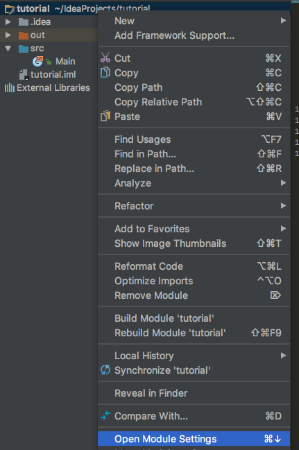
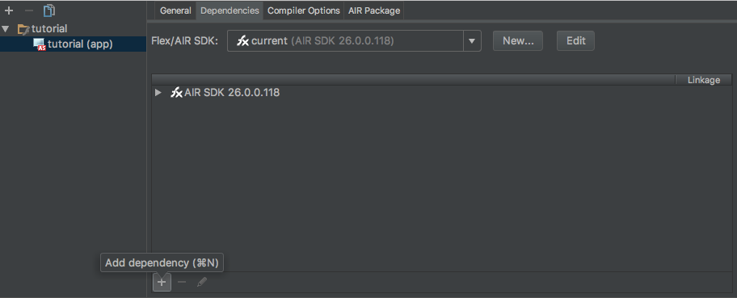
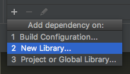
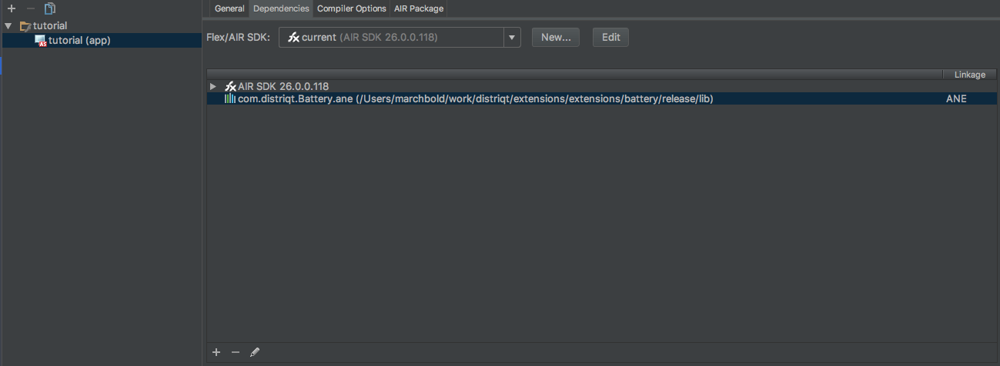
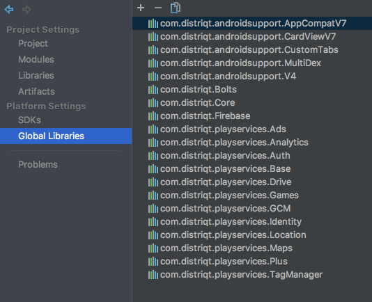
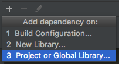
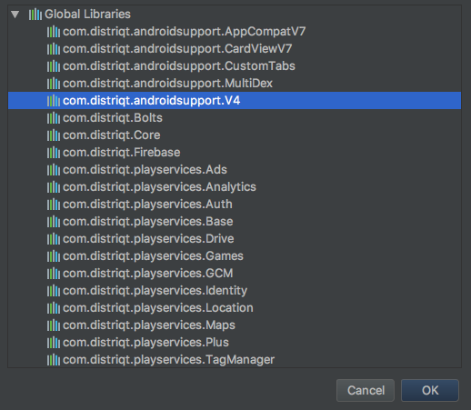

# Getting Started 

## IntelliJ

This tutorial will guide you the process of adding an ANE to your AIR application project in IntelliJ IDEA.

An AIR Native Extension (ANE) is a single file with the extension `ane`. This file contains all of the native and actionscript libraries that are implemented by this extension. You don’t need access to a separate SWC file or to the source code to be able to use the ANE.

We are assuming you have already been through the process of getting AIR development setup in IntelliJ including:

- enabling Flash/Flex support;
- setting AIR SDK paths;
- creating an AIR project.


### Adding the ANE

Open the project you wish to use the ANE and open the module settings of the main module for your application.



Select the **Dependencies** tab. This lists all the libraries that your project depends on including SWCs, ANEs and other build configurations.



At the bottom of the window, select the **+** icon to add a dependency and select **New library**.



Navigate to the location of your ANE and once selected it should appear in the window as a dependency. For example in the following screen shot we have added the Battery ANE:




### Adding the Extension ID

IntelliJ requires that you manually add the extension id to your application descriptor.


The extension id is a string that is used to identify the ANE and correctly package and create the extension. The extension id should be provided by the developer of the ANE.

To add the extension id, open up your application descriptor and add the extension id to the `extensions` node as below:

```xml
<?xml version="1.0" encoding="utf-8" ?>
<application xmlns="http://ns.adobe.com/air/application/26.0">

    <!-- OTHER DESCRIPTOR INFORMATION -->

    <extensions>
        <extensionID>com.distriqt.Battery</extensionID>
    </extensions>

</application>
```


> 
> With the distriqt extensions the extension id is the name of the ANE file, eg for the Battery ANE the file is `com.distriqt.Battery.ane` and the extension id is `com.distriqt.Battery`.
>
> Extensions that have multiple versions, eg PushNotifications, where there are multiple files:
> - `com.distriqt.PushNotifications.ane` 
> - `com.distriqt.PushNotifications.AllServices.ane` 
> - `com.distriqt.PushNotifications.Azure.ane` 
> - `com.distriqt.PushNotifications.FCM.ane` 
>
> the extension id is the first part of the filename without the variant: i.e. `com.distriqt.PushNotifications`
>
> If you have any concerns drop a question in github and we will clear up any confusion.
>


You will now be able to package and use the extension in your application.


## Specifying ANEs as Global Libraries

A useful feature of IntelliJ is being able to setup global libraries. This allows you to setup the path to ANEs (or SWCs) that you use regularly as a global reference and then just select them from the list of globals when adding to a project.

This is particularly useful for ANEs that are used across all projects, such as the Google Play Services ANEs, Android Support ANEs and the Core ANE.

### Adding a Global Library

To add a global library, open your module settings and select **Global Libraries**:



In the list above you can see all the Google Play Services, Android support and Core ANEs which we use in just about every project. Having them defined as globals makes it much easier to add them to your projects.

To add a new global, click the **+** button at the top and select **Actionscript/Flex**:


Then simply navigate to an ANE and select it.


### Using a Global Library

To use a global library ANE simply go to the **Dependencies** tab of your module settings, select add a dependency and select **Project or Global Library**:



Then select the global you wish to use and click **OK**:




You will still need to add the extension id as previously described.


## Notes and Warnings


### Multiple ANEs in a single directory

If you are using any of our ANEs with variants (eg Push Notifications), IntelliJ has a unusual bug of including the first ANE with matching extension id from the directory rather than the one you actually select through the file selection dialogs.

So if you have a directory of several ANEs with the same extension id (as our variants have been in the past) and want to use the FCM variant and have just pointed IntelliJ to that ANE inside the github repository, you have to make sure to remove all the other ANEs from that directory to ensure the correct one gets packaged with your application.

To avoid this we are in process of separating all our variant ANEs into different directories, so you may never encounter this issue. However we just want to make note of this issue in the IntelliJ IDE. 

This doesn't happen with other IDEs.

