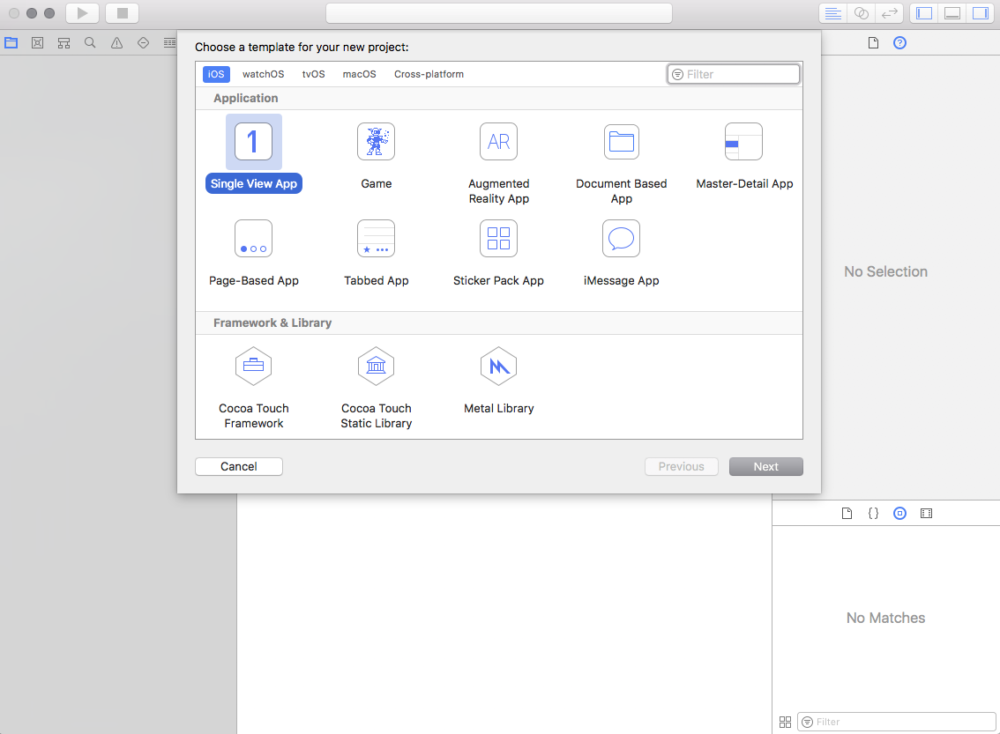
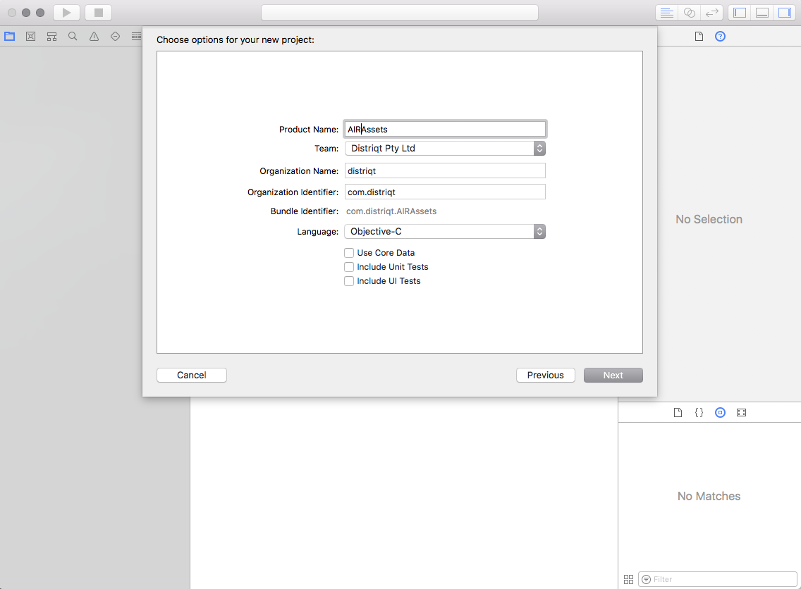
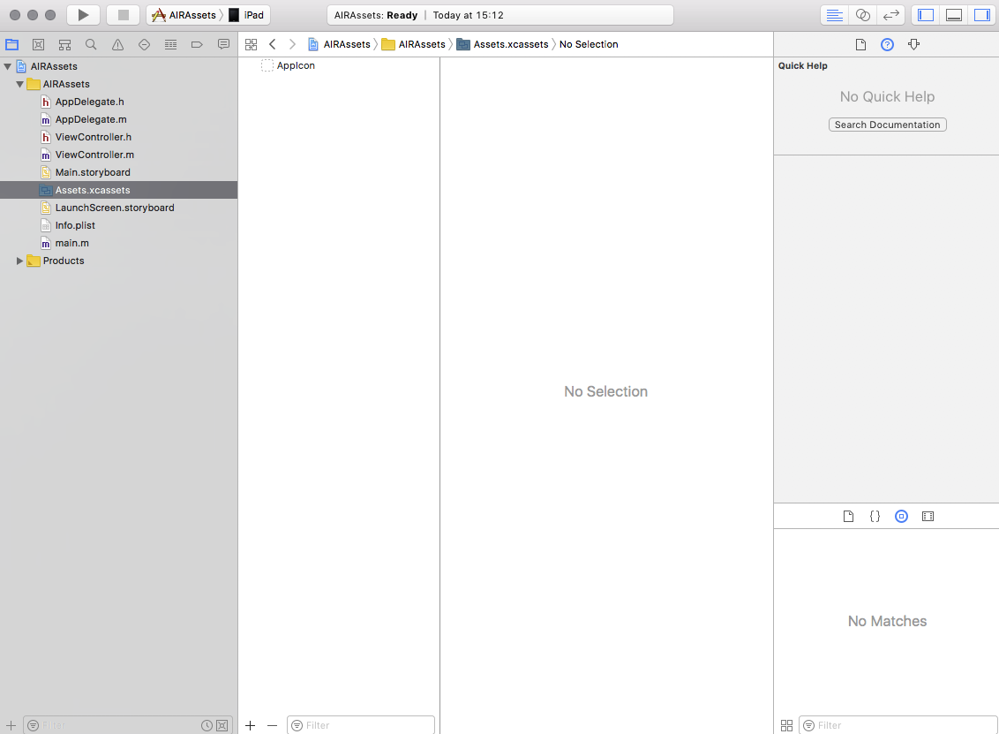
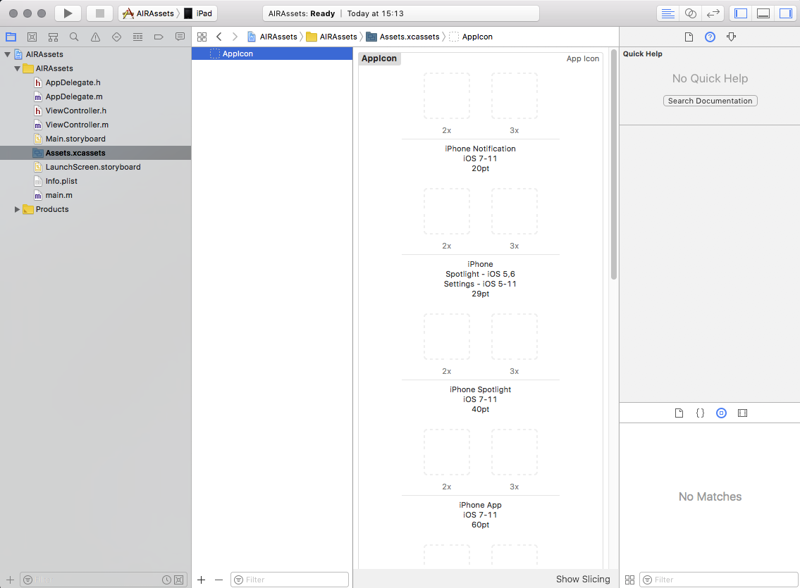
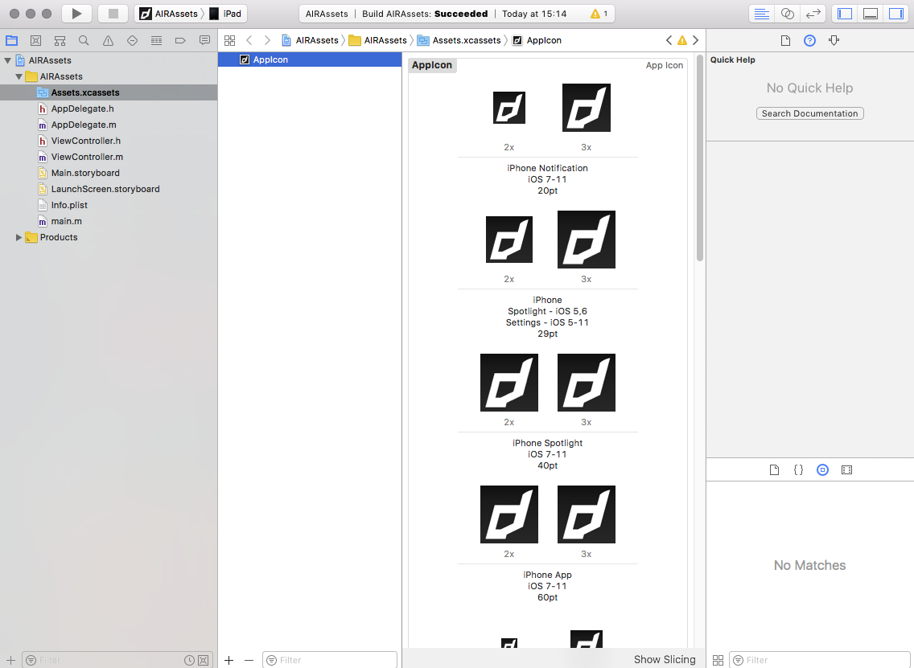

# Icons, Launch Storyboards and the Assets Catalog

From iOS 11 Apple now requires a new process of adding icons to your application, you can no longer simply package them as you have done with previous versions of iOS and AIR. Instead you need to create an asset catalog (`Assets.car` file) and package in the root directory of your application.

>
> Note: The `Assets.car` file is needed for iOS 11+ when you are using AIR SDK v28+
>

Additionallyu from iOS 13 Apple now requires a new process of adding launch / splash screens to your application, you can no longer simply package the "default.png" images in your application you have done with previous versions of iOS and AIR. 

>
> Note: Apple will soon enforce launch screens with the iOS 13 requirement so this will be a prerequisite for publishing in the AppStore
>


Contents:
- [Method 1: Command Line](#method-1-command-line)
- [Method 2: Using Xcode](#method-2-using-xcode)
- [Method 3: Online Tool](#method-3-online-tool)
- [Packaging Asset Catalog](#packaging-asset-catalog)
- [Simple Launch Screen](#simple-launch-screen)
- [Supporting previous versions of iOS](#supporting-previous-versions-of-ios)


## Method 1 Command Line

>
> Note: You will need a macOS machine with Xcode 9+ for this method to generate the `Assets.car` file
>

This is the method we prefer as it is simpler to update and create than having to drag files into Xcode. 

It uses the same directory structure (`Assets.xcassets`) as in your Xcode application however uses the command line to convert this into the `Assets.car`, so you can simply replace the files in the directory and run the script to create your `Assets.car`. 

- Download the following zip and extract it to a working directory somewhere on your machine.
  - [assets-car-build.zip](resources/ios/assets-car-build.zip)
  - You should find a script and a directory called `Assets.xcassets` which contains another directory called `AppIcon.appiconset`.

- Replace all the images in the `AppIcon.appiconset` directory with your own icons. You must replace them with the correctly sized images. You can do this manually or we suggest you use an online tool: [appicon.build](https://www.appicon.build/). This tool will generate all the icons at the correct sizes from a single 1024x1024 image.

- If you are planning on using our simple `LaunchScreen.storyboardc`, replace the `LaunchImage.png` in the `LaunchImage.imageset` directory with your launch image. This will form the launch image on all iOS devices so should be large enough to scale appropriately. If you are planning on implementing your own, simply delete the `LaunchImage.imageset` directory.

- Run the `createAssetsCar` script. This will create a `build` directory and run the following command to build the `Assets.car` file:

```
xcrun actool Assets.xcassets --compile build --platform iphoneos --minimum-deployment-target 8.0 --app-icon AppIcon --output-partial-info-plist build/partial.plist
```


## Method 2 Using Xcode

>
> Note: You will need a macOS machine with Xcode 9+ for this method to generate the `Assets.car` file
>

Firstly you will need to open Xcode and create a new application

- Start a new project and select the "Single View App" under the iOS section (or tvOS section if you are creating this file for a tvOS application).



- Fill Product Name, Organization Name and Organization Identifier (no specific names required).



- Save the project 
- In the left hand panel select the `Assets.xcassets` file



- Select the `AppIcon`




- Add all the required versions of the AppIcon




- Build the project ( Product -> Build).
- Right-click on your ‘.app’ -> Show in finder.
- Right click on your ‘.app’ -> Show package contents.
- Now copy `Assets.car` and package with AIR application.


>
> **If you want to include a launch storyboard see [here](ios-launchscreens).**
>


## Method 3 Online tool

This is the simplest way if you are a Windows developer. 

Simply go to the following url:

[http://applicationloader.net/appuploader/icontool.php](http://applicationloader.net/appuploader/icontool.php)

and upload a 1024x1024 image of your icon. You will get a zip download containing the `Assets.car` file and all the icon sizes needed to embed in your iOS application. 

Using this method you will not be able to add the LaunchImage so you will have to add a story board manually. 


## Packaging Asset Catalog

The `Assets.car` file must be placed at the root of your application, this means alongside your `swf` and other application content. 

You do this by ensuring that it is in the root of your applications source and selected as a single file in your application package.


## Simple Launch Screen

To simplify migration to launch storyboards we have created a simple storyboard that pulls an image from your `Assets.car` and aspect fills it to the screen. You will add a single image to your `Assets.car` alongside your application icons. (If you followed the instructions above this will be the `LaunchImage.png` you added.)

Download this file and extract the `LaunchScreen.storyboardc` file. Add it to your application and ensure it is packaged at the root level of your application alongside your `Assets.car`. 

- [LaunchScreen.storyboardc.zip](resources/ios/LaunchScreen.storyboardc.zip)

Add the following to the `InfoAdditions` node in your application descriptor:

```xml
<key>UILaunchStoryboardName</key>
<string>LaunchScreen</string>
```

That is all, you have now implemented a launch storyboard.


## Supporting previous versions of iOS

You must also make sure that you include the icons in your application using the icon tags in the application descriptor xml. 
This ensures that older versions of iOS still have the correct icons packaged and that other platforms still have the appropriate app icons.


## Launch images

Recently Apple changed the supported names of the files for the default / launch images. Make sure you have correctly added the default images according to the Adobe docs:

[http://blogs.adobe.com/airodynamics/2015/03/09/launch-images-on-ios-with-adobe-air/](http://blogs.adobe.com/airodynamics/2015/03/09/launch-images-on-ios-with-adobe-air/)


