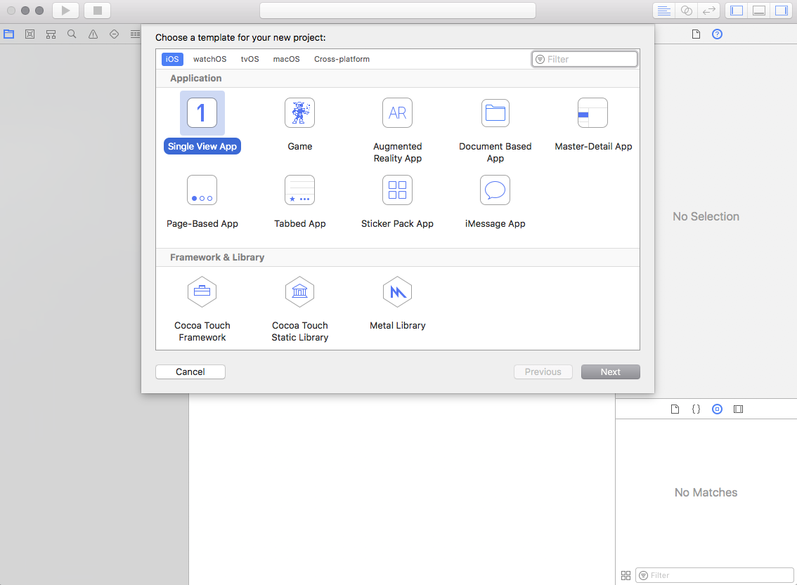
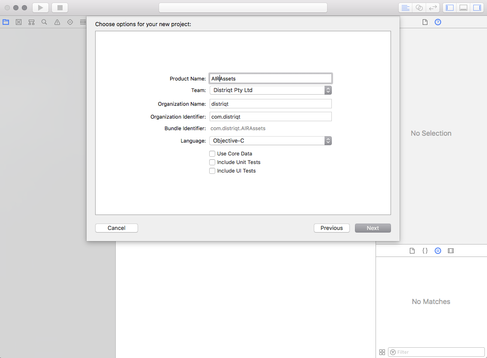
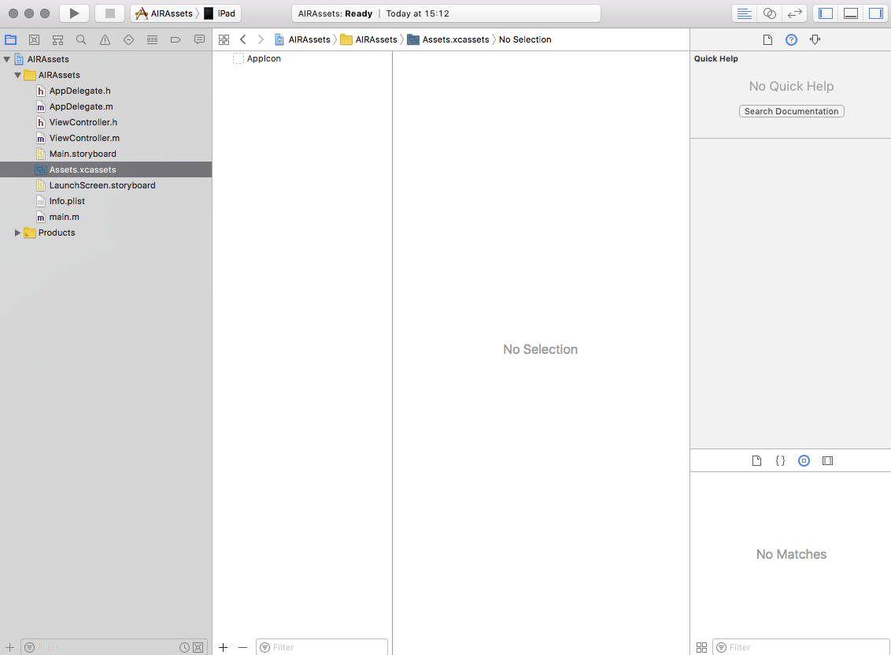
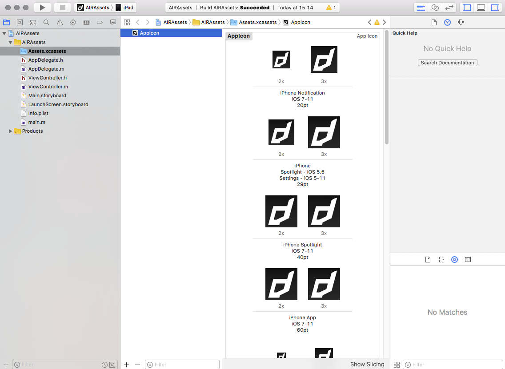

# Launchscreen

From iOS 13 Apple now requires a new process of adding launch / splash screens to your application, you can no longer simply package the "default.png" images in your application you have done with previous versions of iOS and AIR. 

>
> Note: Apple will soon enforce launch screens with the iOS 13 requirement so this will be a prerequisite for publishing in the AppStore
>

This guide shows how to create the launch storyboard directly in Xcode.

Contents:

- [Method 1: Using a script](#method-1)
- [Method 2: Using Xcode](#method-2)
  - [Centered Icon](#centered-icon)
  - [Full Screen Image](#full-screen-image)
  - [Build](#build)
- [Adding to AIR](#adding-to-air)


# Method 1

This simple method uses a prebuilt storyboard which pulls an image from your `Assets.car` and fill the screen keeping the aspect ratio (your image may be cropped on some devices depending on the resolution). 

We have included these instructions as part of the [Icons, Launch Storyboards and the Assets Catalog](ios-icons-assets-car.md#method-1-command-line) guide.


# Method 2 

Using Xcode

>
> Note: You will need a macOS machine with Xcode 9+ for this method to generate the Assets.car file
>

As this process is tightly integrated with generating the `Assets.car` (asset catalog) containing your application icons, we will go through adding the icons first.

Firstly you will need to open Xcode and create a new application

- Start a new project and select the "Single View App" under the iOS section (or tvOS section if you are creating this file for a tvOS application).



- Fill Product Name, Organization Name and Organization Identifier (no specific names required).



- Save the project 
- In the left hand panel select the `Assets.xcassets` file



- Select the `AppIcon`


- Add all the required versions of the AppIcon




Now you have added the application icons we move onto adding the launch storyboard. For this we have included 2 guides:

- A fullscreen image, which scales to fill the screen;
- A centered image (such as the application icon);


## Centered Icon 

Firstly we need to add the image resource to your asset catalog. 

- In the left hand panel select the `Assets.xcassets` file 
- Right click below the `AppIcon` and select *New Image Set*: 

 |

- Name the image set something like `LaunchIcon`
- Populate the set with your image, here we have just used the distriqt app icon: 


- Select the `LaunchScreen.storyboard` in the left hand panel:


- Bring up the Library, either by selecting it in the menu or pressing `cmd - shift - L`, then find the Image View and add it to your view: 


- In the right hand panel select the attributes tab and select your image set you added previously as the "Image":


- Your image should appear in the image view:


- Lastly, we need to add some *constraints* to align the image to the center. Select the constraints icon in the bottom right of the main view and select "Horizontally in Container", "Vertically in Container", then click "Add Constraints" to add these constraints.


## Full Screen Image

Reference:

https://medium.com/flawless-app-stories/change-splash-screen-in-ios-app-for-dummies-the-better-way-e385327219e


## Build

- Build the project ( Product -> Build).
- Right-click on your ‘.app’ -> Show in finder.
- Right click on your ‘.app’ -> Show package contents.
- Locate the following files:
  - `Assets.car`
  - `LaunchScreen.storyboardc`


# Adding to AIR

Once you have completed your storyboard and added the application icons you can add these to your AIR applicaiton.

- Copy `Assets.car` and `LaunchScreen.storyboardc` and package with AIR application at the root level of your application.

- Add the following to your info additions in your application descriptor:

```xml
<key>UILaunchStoryboardName</key>
<string>LaunchScreen</string>
```

i.e.:

```xml
<iPhone>
    <InfoAdditions><![CDATA[            
        <!-- ... -->
        <key>UILaunchStoryboardName</key>
        <string>LaunchScreen</string>
    ]]></InfoAdditions>
</iPhone>
```


