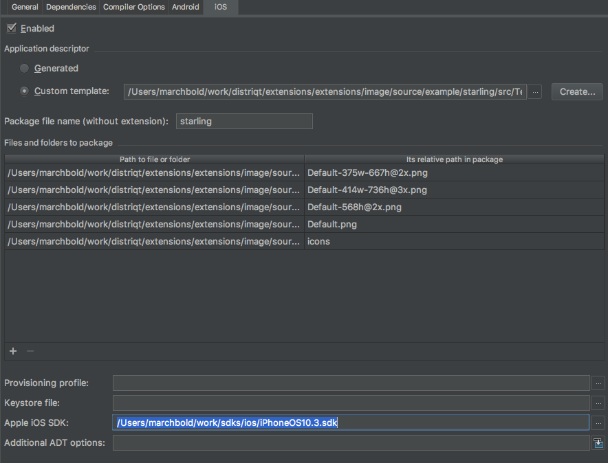
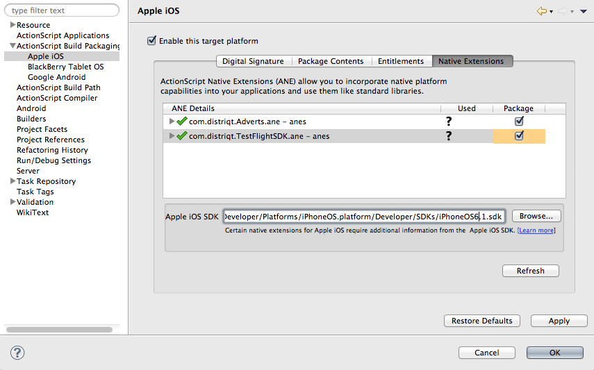
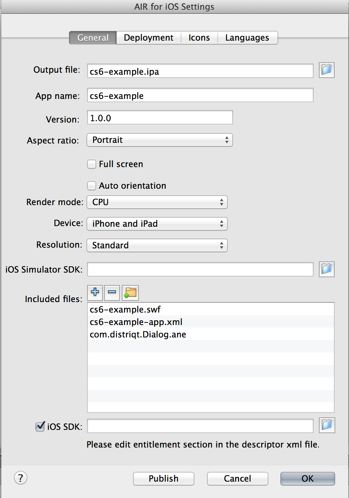

>
> This content is deprecated. See the latest version of this tutorial [here](https://docs.airnativeextensions.com/docs/tutorials/ios-sdk-custom)
> 

# iOS SDK

In the particular case of developing for iOS it is quite often a requirement that you have access to the iOS SDK to access the most recent features of the SDK.

The AIR SDK does contain a subset of the iOS SDK however our ANEs often access parts of the SDK that aren't packaged with AIR hence you will have to provide a reference to a version of the iOS SDK in order to successfully package your application. 

If you don't do this you will encounter errors when packaging such as:

```
Undefined symbols for architecture ... 
```

Or 

```
ld: framework not found ...
```


## Acquire the SDK

The first step in using the iOS SDK with your application is to acquire a version of the SDK. 


### Official Method

The official method uses Xcode on a macOS machine to download the latest version of the SDK

You will need your Apple user ID, this is the same login you use when you access the iOS developer portal but you can sign up for a free one such as the one you use to access iTunes. The SDK is obtained through Apple’s XCode so we need to download and install that.

>
> Note: You’ll need an OSX machine to do this, but you can quite easily do this on windows by installing an OSX virtual machine. You’ll need this machine to get updates to the SDK but once you’ve acquired the SDK you can use it on a windows machine.
>

- Go to https://developer.apple.com/devcenter/ios/index.action
- Enter your Apple login ID information and login
- Once you are logged in, find the “Downloads” link to “Download the latest build of iOS SDK”, it is bundled with Xcode and will be labeled something like “Xcode 4.6.1?, the combined download size of the iPhone SDK and Xcode is quite large, several gigabytes so be prepared for a wait.
- Once Xcode is downloaded, launch the installer and follow the instructions.


You will now have the latest version of the SDK installed on your machine. You’ll need to locate the directory, earlier version of Xcode will place the SDK here:

```
/Developer/Platforms/iPhoneOS.platform/Developer/SDKs/iPhoneOS5.0.sdk
```

However more recent versions will place it here:

```
/Applications/Xcode.app/Contents/Developer/Platforms/iPhoneOS.platform/Developer/SDKs/iPhoneOS11.0.sdk
```


### Unofficial Method

The unofficial method involves downloading one of the zips we have packaged of the iOS SDK. Just download the compressed SDK from our site:

- http://resources.airnativeextensions.com/ios


## Add to your Project

Adding the SDK to your project again depends on your development tool so we will go through each individually below.

>
> Note: If you’re on windows you’ll need to copy the SDK directory completely to your windows machine and use that path in the following.
>


### IntelliJ

In IntelliJ simply open up your module settings, select the iOS tab and enter the path to your iOS SDK in the "Apple iOS SDK" field:




### Flash Builder 4.6 / 4.7

Under Flash Builder 4.6/4.7 you simply go to your project settings and select the Apple iOS section in the Build Packaging. You’ll see a place down the bottom to enter in or browse for the path to the iOS SDK.




### Flash Professional CS6

In Flash CS6 you can simply go into

```
File / AIR 3.x for iOS Settings...
```

Check the box next to iOS SDK and enter in the path to the SDK.




### Flash Professional CS5.5 / Flash Builder 4.5

These remaining environments require usage of the adt command line to include the SDK. In particular we’re going to be using the `platformsdk` option of `adt`.

You should already have created a script or at least have a command to run on the command line from the previous sections. If you haven’t consult the section on Flash Builder 4.5 for a detailed guide. Windows developers using other environments should also do this.

In order to add the iOS SDK all we need to do is add in the platformsdk option with the full path to the SDK. For example:

```
adt -package
	-target ipa-test
	-provisioning-profile /path_to_provisioning_profile/Provisioning_Profile.mobileprovision
	-storetype pkcs12
	-keystore /path_to_certificate/certificate.p12
	-storepass xxxxx
	myApp.ipa
	application_xml_file.xml
	application_swf.swf
	-platformsdk /Applications/Xcode.app/Contents/Developer/Platforms/iPhoneOS.platform/Developer/SDKs/iPhoneOS6.1.sdk
```				
                    


### Command Line

These remaining environments require usage of the adt command line to include the SDK. In particular we’re going to be using the platformsdk option of adt.

You should already have created a script or at least have a command to run on the command line from the previous sections. If you haven’t consult the section on Flash Builder 4.5 for a detailed guide. Windows developers using other environments should also do this.

In order to add the iOS SDK all we need to do is add in the platformsdk option with the full path to the SDK. For example:


```
adt -package
	-target ipa-test
	-provisioning-profile /path_to_provisioning_profile/Provisioning_Profile.mobileprovision
	-storetype pkcs12
	-keystore /path_to_certificate/certificate.p12
	-storepass xxxxx
	myApp.ipa
	application_xml_file.xml
	application_swf.swf
	-platformsdk /Applications/Xcode.app/Contents/Developer/Platforms/iPhoneOS.platform/Developer/SDKs/iPhoneOS6.1.sdk
```

>
> Note: you’ll need a more recent version of AIR to use this platformsdk option. Version prior to 3.2 do not have this ability and you won’t be able to include the iOS SDK.
>


