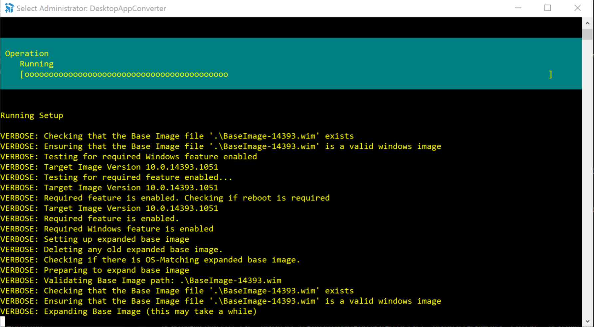

# Windows Store Packaging

The Desktop App Converter can be used to turn your AIR application into an appx installer for the Windows Store. This is an important process to be able to convert your AIR app into a UWP application.

A brief article on the process can be found [here](https://blogs.msdn.microsoft.com/appconsult/2018/03/14/distribute-your-adobe-air-apps-through-the-microsoft-store-with-the-captive-runtime-bundle/)

More information on the Desktop App Converter can be found [here](https://docs.microsoft.com/en-us/windows/uwp/porting/desktop-to-uwp-run-desktop-app-converter).

## Setup the Desktop App Converter

To set up the Desktop App Converter (DAC):

1. [Download the Desktop App Converter](https://aka.ms/converter) app from the Windows Store.

> NOTE: If you are not using the installer for you don't need the `wim` file and you can skip to the next step once you have the converter installed

2. Based on your Windows build version (which you can check by opening the Start menu and typing winver), download an appropriate .wim file from the [Microsoft Store](https://aka.ms/converterimages).
3. Run the Desktop App Converter as an administrator on your computer.
4. In the prompt that appears, run this command: `Set-ExecutionPolicy bypass`
5. Set up the Desktop App Converter by running this command: `DesktopAppConverter.exe -Setup -BaseImage .\BaseImage-1XXXX.wim -Verbose`

> TIP: Don’t put the .wim file in a folder that contains other files, such as .iso or .exe files or any other installation files, because it will get copied to your C:\ drive.

## Converting your AIR application

This process has several approaches which vary slightly. They all start with installation of the desktop app converter (above) and then vary in the usage of the tool.

The method we suggest involves separating out some of the automated process in order to speed up testing. In involves a few extra steps to get started but is much easier to work with once setup. 

We have listed the various approaches we have found here:

- [Method 1: Sign separately](windows-appx-packaging-method1) **suggested**
- [Method 2: Use the AIR exe directly](windows-appx-packaging-method2) *easiest*
- [Method 3: Use an installer](windows-appx-packaging-method3)

>
> IMPORTANT: For this process to be successful you will need to package your AIR application with the captive runtime using the `-target bundle`. Shared runtime is not supported!
>

## Submission

You should now be able to use the `appx` file to submit to the store. 

You must have acquired permission to submit Desktop Bridge applications before this step. If you haven't you will see the following error: 

>
> 	Package acceptance validation error: Your developer account doesn't have permission to submit apps converted with the Desktop Bridge at this time. https://aka.ms/desktopbridgeforwindowsstore
>

## External Docs 

- Package an app using the Desktop App Converter (Desktop Bridge) https://docs.microsoft.com/en-us/windows/uwp/porting/desktop-to-uwp-run-desktop-app-converter

## Acknowledgements 

This documentation is based on the [e-pity case study](https://microsoft.github.io/techcasestudies/desktop%20bridge/2017/06/08/e-pity.html)

